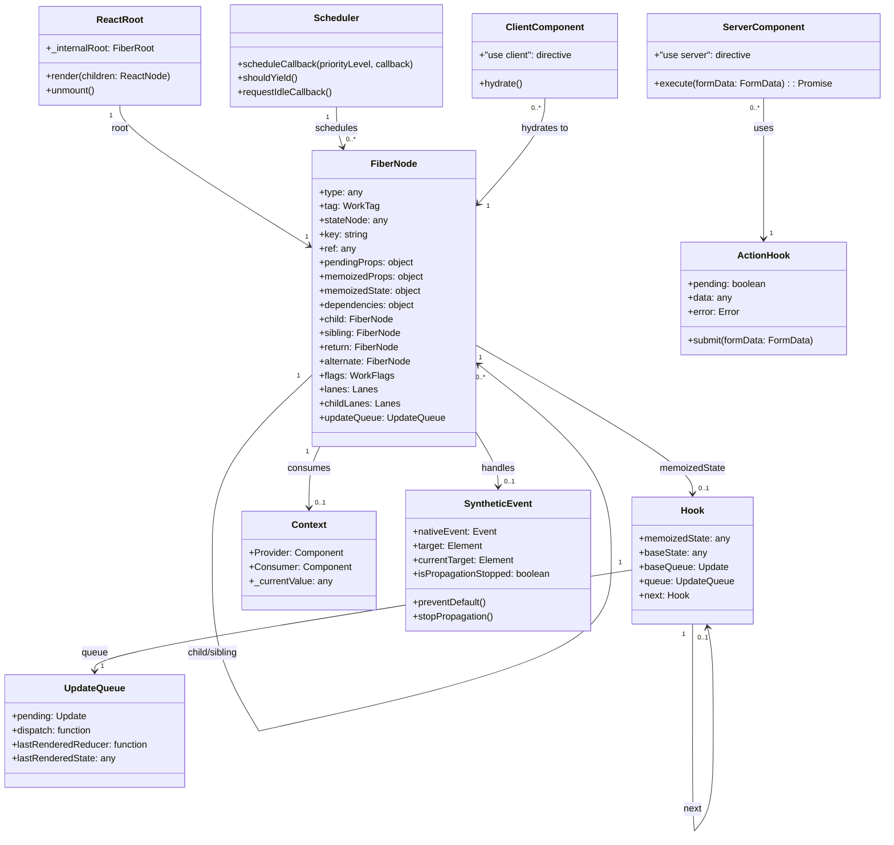
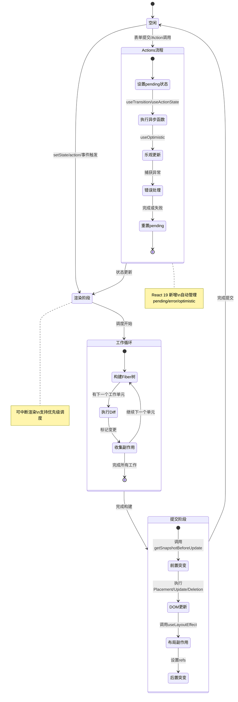

要实现一个完整的 React 19 官方框架，需要实现的核心功能可以分为两大部分：**核心架构基础**（从零搭建一个 UI 库必须的部分）和 **React 19 新特性**（官方在 v19 中引入的独特功能）。下面我将结合官方文档和最新版本特性，为你整理一份详细的功能清单，并附上相应的 UML 图。

---

## 📋 React 19 框架完整功能清单

### 一、核心架构基础（Core Architecture）

这部分是任何 React 版本都必需的基础设施：

1.  **React 核心包 (@react)**
    -   **Fiber 架构**：可中断的渲染工作循环，支持任务优先级调度 
    -   **双缓冲机制**：current 树（当前 UI）和 workInProgress 树（下次更新）
    -   **渲染器接口**：支持不同平台（react-dom、react-native）
    -   **事件系统**：合成事件（SyntheticEvent）、事件委托、跨浏览器兼容

2.  **React DOM 包 (react-dom)**
    -   **客户端渲染**：`createRoot`、`hydrateRoot`
    -   **服务端渲染**：`renderToString`、`renderToPipeableStream`、`renderToReadableStream`
    -   **静态 API**：`prerender`（用于 SSG，React 19 新增）

3.  **组件模型**
    -   **函数组件**：支持 `props`、`children`
    -   **Fragment**：返回多个元素
    -   **Suspense**：支持加载状态和回退 UI 
    -   **Error Boundary**：错误边界处理 

4.  **Hooks 基础集**
    -   **状态类**：`useState`、`useReducer`
    -   **副作用类**：`useEffect`、`useLayoutEffect`
    -   **上下文类**：`useContext`
    -   **引用类**：`useRef`、`useImperativeHandle`
    -   **性能优化类**：`useMemo`、`useCallback`

5.  **协调与渲染**
    -   **Diff 算法**：基于 key 的节点复用
    -   **副作用标记**：Placement、Update、Deletion
    -   **批量更新**：自动批处理（Automatic Batching）

### 二、React 19 新特性功能（必须实现的 v19 特色）

根据 React 19 官方发布文档和后续更新，你需要实现以下功能 ：

| 功能类别 | 具体功能 | 描述 | 来源 |
| :--- | :--- | :--- | :--- |
| **Server Components** | RSC 运行时 | 支持 `"use server"` 和 `"use client"` 指令，服务器端渲染组件 |  |
| | 服务器函数 | 允许在服务器上执行函数，减少客户端逻辑 |  |
| **Actions** | 异步 Transition | `useTransition` 支持 async 函数，自动管理 pending 状态 |  |
| | `useActionState` | 替代 `useFormState`，管理 Action 的执行状态和结果 |  |
| | `useFormStatus` | 读取父 `<form>` 的 pending 状态 |  |
| | `useOptimistic` | 乐观更新，立即反馈用户操作 |  |
| **新 Hook/API** | `use` API | 在渲染中读取 Promise 或 Context（可条件调用） |  |
| | `useEffectEvent` | 将事件逻辑从 useEffect 中解耦（React 19.2） |  |
| **文档元数据** | 原生 Meta 支持 | `<title>`、`<meta>` 等标签自动提升到 `<head>` |  |
| **资源加载** | 资源预加载 | `preload`、`preinit`、`prefetchDNS`、`preconnect` |  |
| **Ref 改进** | `ref` 作为 prop | 不再需要 `forwardRef`，直接传递 `ref` |  |
| **错误处理** | 增强错误报告 | `onCaughtError`、`onUncaughtError` 根选项 |  |
| **编译器** | React 编译器 | 自动记忆化（memoization），替代手动 `useMemo`/`useCallback` |  |
| **新组件** | `<Activity>` | 条件渲染/隐藏 UI，保留状态（React 19.2） |  |
| **SSR 增强** | 部分预渲染 | 应用程序部分预渲染，提高初始加载响应性 |  |

---

## 📊 UML 类图 - React 19 核心架构

下面这张类图展示了 React 19 的核心数据结构关系，帮助你从架构层面理解各个模块如何协同工作：

---

## 🔄 UML 状态图 - React 19 渲染生命周期

这张状态图展示了从更新触发到 UI 最终渲染的完整流程，特别突出了 React 19 中的 Actions 流程：

---

## 🧠 核心实现要点解析

根据 React 官方团队和社区专家的总结，实现一个完整的 React 19 框架需要注意以下技术要点 ：

### 1. **Fiber 架构的双缓冲机制**
- 需要维护两棵树：current（当前屏幕）和 workInProgress（下次更新）
- 通过 `alternate` 指针相互引用，实现快速切换和复用

### 2. **优先级调度与可中断渲染**
- 使用 `requestIdleCallback` 或 `Scheduler` 实现时间切片
- 每个 Fiber 节点带有 `lanes` 优先级标记
- 高优先级任务可打断低优先级任务

### 3. **Hooks 的链表结构**
- 每个函数组件对应一个 Fiber 节点，Fiber 上维护 Hooks 链表
- 渲染时按顺序创建/复用 Hook 对象
- `useState`、`useEffect` 等通过 Hook 上的 `queue` 管理更新

### 4. **Server Components 的实现**
- 需要在打包层面区分客户端和服务端代码
- `"use server"` 函数会被转换为 API 端点
- 服务器组件返回的是一种特殊序列化格式（RSC Payload）

### 5. **Actions 的自动状态管理**
- 异步函数在 `startTransition` 中调用时自动管理 `isPending`
- `useActionState` 组合了 pending、data、error 状态
- `useFormStatus` 通过 Context 读取表单状态 

### 6. **合成事件与事件委托**
- 所有事件绑定到根容器，使用事件委托
- 合成事件对象池化，提高性能
- 跨浏览器兼容性处理

### 7. **React 编译器的自动记忆化**
- 分析组件依赖，自动插入 `useMemo`/`useCallback`
- 减少手动优化工作，提升性能 

---

## 📚 总结

要实现一个完整的 React 19 框架，你需要：

1. **底层基础**：Fiber 架构、调度器、渲染器、事件系统
2. **核心 API**：Hooks、Context、Refs、Suspense
3. **React 19 特色**：Server Components、Actions 系列 Hooks、`use` API、文档元数据、资源加载
4. **性能优化**：编译器自动记忆化、并发特性
5. **SSR/SSG**：流式渲染、静态预生成

这份清单涵盖了 React 19 官方发布的所有核心功能和后续版本（19.2）的增强特性 。建议按照先核心架构、后新特性的顺序逐步实现，同时可以参考上面提供的 UML 图来设计代码结构。