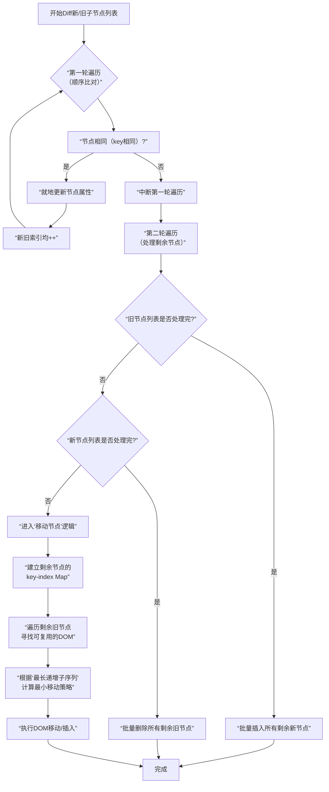

理解虚拟DOM Diff算法中**“移动位置元素的识别与插入”**确实是实现核心渲染器的关键难点。这个过程比“创建/删除”要复杂得多，因为它需要在最小化DOM操作的前提下，**精准地识别出哪些节点只是位置变了**。

### 🧠 核心算法：如何处理节点位置移动

简单来说，Diff算法在处理节点列表时（比如通过`.map`渲染的多个子元素），为了高效地更新DOM，会经历几个关键阶段。下图概括了这一核心流程：



上图展示了React在Diff子节点列表时的核心决策流程。其中最复杂的部分在于第二轮遍历中，如何通过**“最长递增子序列”** 算法来实现最小化的DOM移动。

### 🔍 详解“移动节点”逻辑
在第二轮遍历中，当新旧列表都还有剩余节点时（说明顺序很可能发生了改变），算法会执行以下步骤来找出最高效的更新方式：

1.  **建立映射**：为**剩余的新节点**建立一个从 `key` 到 `index`（在新列表中的位置）的映射表 `keyIndexMap`。
2.  **寻找可复用节点**：遍历**剩余的旧节点**，用它的 `key` 去 `keyIndexMap` 里查找。如果找到了，说明这个旧节点对应的DOM元素可以**复用**，只是可能需要**移动位置**。这时会记录下这个旧节点在新列表中的位置（`newIndex`）。
3.  **计算移动策略**：现在得到了一个序列，记录了**可复用的旧节点**在**新列表中的目标位置**。我们的目标是**用最少的移动步数**，将这个序列变成有序的（递增的）。
    *   这里就用到了 **“最长递增子序列”** 算法。这个算法能找出序列中**最长的一组可以不移动的节点**。
    *   **例如**：可复用节点的新索引序列是 `[2, 3, 1, 4]`，其最长递增子序列（LIS）是 `[2, 3, 4]`（对应索引 `0, 1, 3`）。这意味着，在最终操作时，位于新索引 `2`, `3`, `4` 的这三个节点**不需要移动**，我们只需要移动节点 `1` 到正确位置即可。
4.  **执行DOM操作**：从后往前遍历可复用节点。如果当前节点不在“最长递增子序列”中，或者它的当前位置不符合新顺序，就执行 `insertBefore` 将它移动到正确的位置。

### 💻 关键代码实现示意
下面是一个极度简化的代码片段，旨在展示**最长递增子序列在Diff算法中的应用逻辑**：

```javascript
// 假设这是我们通过一系列比较后，得到的可复用节点在“新列表”中的索引数组
const newIndices = [2, 3, 1, 4]; // 旧节点A/B/C/D，分别应该移动到新位置2,3,1,4

// 1. 计算“最长递增子序列”（LIS）的索引
// 注意：真实的LIS算法更复杂，这里假设已实现 getLISIndices 函数
const lisIndices = getLISIndices(newIndices); // 结果可能是 [0, 1, 3] (对应值2,3,4)

// 2. 从后向前遍历，避免插入位置计算错误
const toMoveNodes = []; // 假设这里存放了对应的旧DOM节点引用
let lastIndex = newIndices.length - 1;

for (let i = toMoveNodes.length - 1; i >= 0; i--) {
  const domNode = toMoveNodes[i];
  const targetIndexInNewList = newIndices[i];
  
  // 判断这个节点是否需要移动
  if (!lisIndices.includes(i)) {
    // 找到这个节点应该插入到哪个“已知正确位置”的节点之前
    const anchorNode = findAnchorNode(targetIndexInNewList); // 需要你实现
    const parentDom = domNode.parentNode;
    // 如果它不在正确位置，就移动它
    if (anchorNode !== domNode.nextSibling) {
      parentDom.insertBefore(domNode, anchorNode);
    }
  }
}
```

### 📊 为什么说这个算法高效？

| 操作类型 | 平均时间复杂度 | 说明 |
| :--- | :--- | :--- |
| **建立 `key` 映射** | O(n) | 遍历一遍新列表即可 |
| **查找可复用节点** | O(n) | 遍历旧列表，每次用 `key` 查 Map 是 O(1) |
| **计算最长递增子序列** | O(n log n) | 这是整个 Diff 中最耗时的部分，但通常 `n` 很小（只是变更的部分） |
| **总体性能** | **接近 O(n)** | 对于 UI 更新来说，性能表现非常出色 |

### 🚀 动手实现建议

要实现这个算法，我建议你分步进行：

1.  **先实现一个不使用 `key` 的简单Diff**：仅通过索引位置对比，执行简单的更新、增删。这能帮你建立基础流程。
2.  **加入 `key` 的支持，实现复用逻辑**：在第一步基础上，先实现节点的复用（通过 `key` 匹配），但暂时**只处理创建和删除，不处理移动**。验证复用是否正确。
3.  **实现完整的、带移动的Diff**：这是最难的一步。你需要：
    *   编写一个 `getSequence` 函数来计算最长递增子序列的索引。
    *   在Diff过程中收集可复用的节点及其新索引。
    *   应用上面的算法逻辑，计算出需要移动的节点并执行 `insertBefore`。
4.  **大量测试**：用各种顺序变化的案例测试（头/尾插入、中间插入、逆序、随机打乱），确保DOM操作次数确实是最少的。

理解并实现这部分，是构建一个高效渲染引擎的核心。如果你想进一步探讨某个具体步骤的代码实现，或者对“最长递增子序列”算法的代码细节有疑问，我可以继续提供更详细的解释和代码示例。