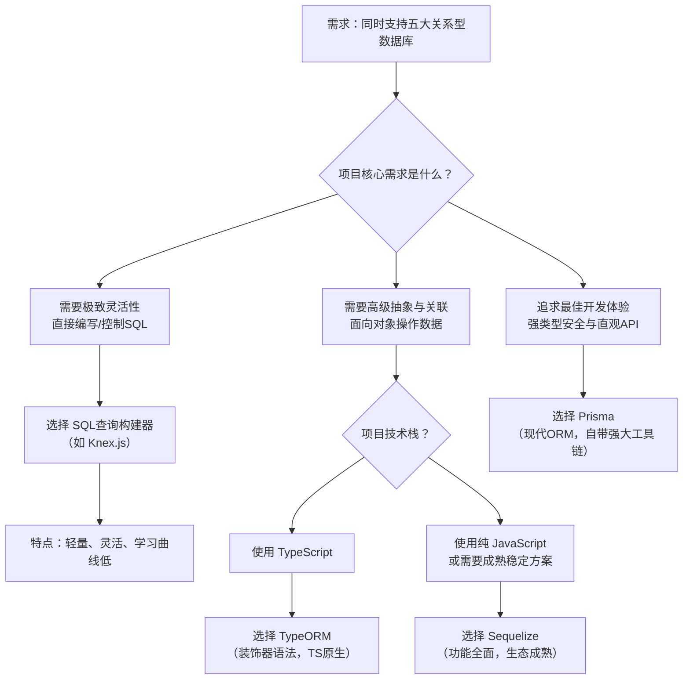

我来为您梳理能够同时支持**MySQL、PostgreSQL、Oracle、SQL Server、SQLite**这五种数据库的解决方案。根据您描述的需求——需要同时支持多种关系型数据库，目前主要有以下几类解决方案：

### 🛠️ **方案对比：SQL查询构建器 vs ORM**

| 方案类型 | 推荐工具 | 支持数据库 | 核心特点 | 适用场景 |
|:---|:---|:---|:---|:---|
| **SQL查询构建器** | **Knex.js** | ✅ MySQL, PostgreSQL, Oracle, SQLite, SQL Server等 | 提供统一的SQL查询接口，灵活、贴近SQL，是许多ORM的底层依赖 | 需要直接控制SQL、编写复杂查询或构建通用数据库工具 |
| **Node.js ORM** | **Sequelize** | ✅ MySQL, PostgreSQL, SQLite, SQL Server, Oracle (需驱动) | 功能全面的ORM，提供模型、关联、事务、迁移等高层抽象 | 需要面向对象操作、模型关联、数据迁移等ORM特性 |
| **Node.js ORM** | **TypeORM** | ✅ 全部支持 | 基于TypeScript设计，支持Active Record和Data Mapper模式 | TypeScript项目，需要装饰器语法和更现代的ORM体验 |
| **查询构建器 + ORM** | **Prisma** (需Prisma Client) | ✅ MySQL, PostgreSQL, SQLite, SQL Server, Oracle (预览) | 下一代ORM，类型安全，自带迁移工具和可视化数据浏览器 | 强调开发体验、类型安全和现代工作流的新项目 |

### 🗺️ 决策流程图：如何选择最适合您的工具？



### 📝 各方案详解与代码示例

#### 1. **Knex.js (SQL查询构建器) - 灵活控制SQL**
   Knex.js不直接操作数据库，而是提供统一的API来构建SQL语句。
   ```javascript
   // 安装: npm install knex mysql2 (或pg, oracledb, tedious, sqlite3等)
   const knex = require('knex')({
     client: 'mysql', // 可改为 'pg', 'oracledb', 'mssql', 'sqlite3'
     connection: {
       host: '127.0.0.1',
       user: 'your_user',
       password: 'your_password',
       database: 'your_db'
     }
   });

   // 统一的查询语法，Knex会生成对应数据库的SQL
   const users = await knex('users')
     .select('id', 'name')
     .where({ status: 'active' })
     .orderBy('created_at', 'desc')
     .limit(10);
   ```

#### 2. **Sequelize (成熟ORM) - 功能全面**
   ```javascript
   // 安装: npm install sequelize mysql2 (或对应驱动)
   const { Sequelize, DataTypes } = require('sequelize');

   // 连接不同数据库只需改变dialect参数
   const sequelize = new Sequelize('database', 'username', 'password', {
     host: 'localhost',
     dialect: 'postgres', // 'mysql' | 'postgres' | 'sqlite' | 'mssql' | 'oracle'
   });

   // 定义模型
   const User = sequelize.define('User', {
     name: { type: DataTypes.STRING },
     email: { type: DataTypes.STRING, unique: true }
   });

   // 面向对象操作
   const newUser = await User.create({ name: 'John', email: 'john@example.com' });
   const activeUsers = await User.findAll({ where: { status: 'active' } });
   ```

#### 3. **TypeORM (TypeScript ORM) - 现代开发体验**
   ```typescript
   // 安装: npm install typeorm reflect-metadata
   import { Entity, PrimaryGeneratedColumn, Column, createConnection } from 'typeorm';

   @Entity()
   export class User {
     @PrimaryGeneratedColumn()
     id: number;

     @Column()
     name: string;

     @Column()
     email: string;
   }

   // 在ormconfig.json中配置数据库连接
   // 支持mysql, postgres, sqlite, mssql, oracle
   const connection = await createConnection();
   const userRepository = connection.getRepository(User);
   const users = await userRepository.find({ where: { status: 'active' } });
   ```

#### 4. **Prisma (下一代ORM) - 类型安全与工具链**
   ```javascript
   // 1. 定义数据模型 (schema.prisma)
   model User {
     id    Int     @id @default(autoincrement())
     name  String
     email String  @unique
   }

   // 2. 生成类型安全的客户端
   // npx prisma generate

   // 3. 使用
   const { PrismaClient } = require('@prisma/client');
   const prisma = new PrismaClient();

   const newUser = await prisma.user.create({
     data: { name: 'Alice', email: 'alice@example.com' }
   });
   ```

### 💡 重要提醒：架构与安全

**无论选择哪个库，都需要注意**：
1.  **这些都是在Node.js后端环境使用的库**，不是在浏览器中直接运行的。
2.  **绝对不能在前端代码中暴露数据库连接信息**（如主机、用户名、密码）。
3.  正确的架构是：前端通过HTTP API（如RESTful、GraphQL）请求后端服务，由后端服务使用上述库安全地操作数据库。

### 🎯 我的建议

1.  **从Knex.js开始**：如果您对SQL熟悉，需要灵活性，或正在构建需要支持多种数据库的工具/中间件。
2.  **选择Sequelize**：如果您的项目需要成熟的ORM功能（如数据关联、迁移、事务），并且团队已经熟悉Active Record模式。
3.  **尝试TypeORM**：如果项目使用TypeScript，并且您喜欢装饰器语法和更现代的架构。
4.  **考虑Prisma**：如果是新项目，注重开发体验、类型安全和直观的数据操作。

如果您能告诉我更多关于您的**项目类型**（如Web应用、企业软件、工具开发等）、**技术栈**（如Node.js版本、是否使用TypeScript）和**具体使用场景**，我可以给您更精确的建议。