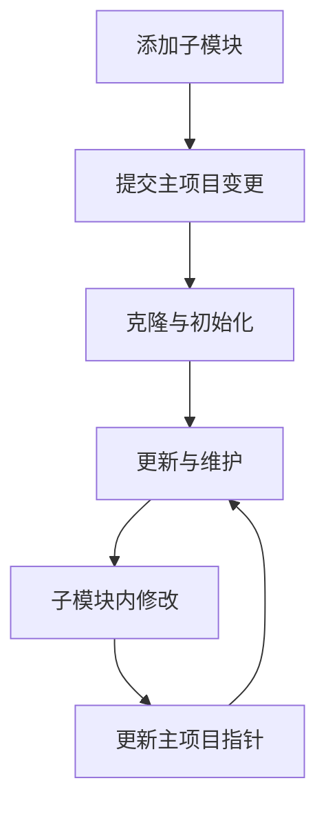

```bash
git submodule [--quiet] [--cached]
git submodule [--quiet] add [<options>] [--] <repository> [<path>]
git submodule [--quiet] status [--cached] [--recursive] [--] [<path>…​]
git submodule [--quiet] init [--] [<path>…​]
git submodule [--quiet] deinit [-f|--force] (--all|[--] <path>…​)
git submodule [--quiet] update [<options>] [--init] [--recursive] [--depth] [--remote] [--] [<path>…​]
git submodule [--quiet] set-branch [<options>] [--] <path>
git submodule [--quiet] set-url [--] <path> <newurl>
git submodule [--quiet] summary [<options>] [--] [<path>…​]
git submodule [--quiet] foreach [--recursive] <command>
git submodule [--quiet] sync [--recursive] [--] [<path>…​]
git submodule [--quiet] absorbgitdirs [--] [<path>…​]
git rm --cached packages/rc-components -r
```

```
git submodule add --depth=1 git@github.com:ant-design/ant-design.git packages/antd

git submodule add --depth=1  git@github.com:ant-design/pro-components.git packages/pro-components

git submodule add --depth=1  git@github.com:alibaba/hooks.git packages/ahooks

git submodule add --depth=1  git@github.com:facebook/react.git packages/react

git submodule add --depth=1   git@github.com:ant-design/ant-design-mobile.git packages/antd-mobile
git submodule add --depth=1  git@github.com:react-component/field-form.git packages/field-form
git submodule add --depth=1  git@github.com:react-component/upload.git packages/rc-upload
git submodule add --depth=1  git@github.com:react-component/table.git packages/rc-table
git submodule add --depth=1  git@github.com:react-component/async-validator.git packages/async-validator
git submodule add --depth=1  git@github.com:react-component/util.git packages/rc-util
git submodule add --depth=1  git@github.com:clauderic/dnd-kit.git packages/dnd-kit
git submodule add --depth=1 git@github.com:react-dnd/react-dnd.git packages/react-dnd
git submodule add --depth=1  git@github.com:reduxjs/redux.git packages/redux
git submodule add --depth=1  git@github.com:reduxjs/react-redux.git packages/react-redux
git submodule add --depth=1 git@github.com:immutable-js/immutable-js.git packages/immutable-js

git submodule add -b v5-wip git@github.com:lodash/lodash.git packages/lodash

git submodule add --depth 1 git@github.com:arco-design/arco-design.git packages/arco-design-react

git submodule add --depth 1 git@github.com:epoberezkin/fast-deep-equal.git packages/fast-deep-equal

git submodule add --depth 1 git@github.com:iamkun/dayjs.git  packages/dayjs
git submodule add --depth 1 git@github.com:react-component/dialog.git packages/rc-dialog
git submodule add --depth 1 git@github.com:react-component/upload.git
git submodule add --depth 1 git@github.com:react-hook-form/react-hook-form.git packages/react-hook-form

git submodule add --depth 1 git@github.com:moment/moment.git packages/moment


git submodule add --depth 1 git@github.com:Tencent/tdesign-vue-next.git packages/tdesign-vue-next
git submodule add --depth 1 git@github.com:vueComponent/ant-design-vue.git packages/ant-design-vue
git submodule add --depth 1 git@github.com:arco-design/arco-design-vue.git packages/arco-design-vue

git submodule add --depth 1 git@github.com:DouyinFE/semi-design.git packages/semi-design
git submodule add --depth 1 git@github.com:tusen-ai/naive-ui.git packages/naive-ui
git submodule add --depth 1 git@github.com:element-plus/element-plus.git packages/element-plus
git submodule add --depth 1 git@github.com:vueuse/vueuse.git packages/vueuse
git submodule add --depth 1 git@github.com:InhiblabCore/vue-hooks-plus.git packages/vue-hooks-plus
```

为 `packages` 目录添加 GitHub 开源仓库作为子模块是个好主意，这能方便你管理依赖并同步更新。你想知道具体如何操作，下面我来为你详细说明。

# 🛠️ Git 子模块添加与管理指南

通过 Git 子模块，你可以在主项目中引入并管理其他独立的 GitHub 开源仓库。子模块允许你将一个 Git 仓库作为另一个 Git 仓库的子目录，它能让你将另一个仓库克隆到自己的项目中，同时还保持提交的独立。这对于管理项目依赖、公共库或第三方组件非常有用。

## 🔍 核心概念理解

Git 子模块的本质是**主项目（父仓库）并不直接存储子模块的代码文件内容，而是记录一个“指针”**，这个指针精确地指向子模块仓库的某一个特定的 Commit ID。这意味着：
-   **主项目**仅记录子模块的仓库 URL 和它所指向的特定提交。
-   **子模块**自身是一个完整的 Git 仓库，保持独立的版本历史和开发流程。
-   当你克隆主项目时，默认情况下子模块的目录是空的，你需要执行特定的命令来填充它们。

## 📦 为 packages 目录添加子模块

下面是为你的 `packages` 目录添加 GitHub 开源仓库作为子模块的步骤。

### 第一步：添加子模块

1.  **打开终端**并进入你的主 Git 仓库根目录。
2.  使用 `git submodule add` 命令添加子模块。命令格式如下：
    ```bash
    git submodule add <子模块仓库URL> <子模块路径>
    ```
    例如，如果你想将 `https://github.com/exampleuser/example-repo.git` 这个开源仓库添加到你的 `packages/example-repo` 目录下，可以运行：
    ```bash
    git submodule add https://github.com/exampleuser/example-repo.git packages/example-repo
    ```
    如果你想添加多个子模块，只需重复此步骤，指定不同的仓库 URL 和目标路径即可。

3.  **验证添加结果**：执行上述命令后，Git 会进行以下操作：
    -   克隆子模块仓库到指定的 `packages/example-repo` 路径。
    -   在主项目的根目录创建一个名为 `.gitmodules` 的文件（如果之前不存在），该文件记录了每个子模块的路径和 URL。
    -   将子模块的当前最新提交记录到主项目的暂存区。

    你可以通过 `git status` 命令查看变化，通常会显示 `.gitmodules` 文件和新增的子模块路径已被暂存。

### 第二步：提交主项目的变更

添加子模块后，你需要提交主项目的变更，以记录你对子模块的引用。

```bash
git commit -m "feat: 添加 example-repo 作为子模块到 packages 目录"
git push
```

这会将 `.gitmodules` 文件和新子模块的提交哈希推送到主项目的远程仓库。

## 🔄 克隆与初始化包含子模块的项目

当其他人（或者你在另一台机器上）克隆你的主项目时，他们需要额外一步来初始化和更新子模块。

### 克隆时同时初始化子模块

推荐在克隆主项目时使用 `--recurse-submodules` 参数，这样可以一次性克隆主项目并初始化、拉取所有子模块的内容：
```bash
git clone --recurse-submodules <你的主项目仓库URL>
```

### 克隆后初始化子模块

如果已经克隆了主项目但没有使用 `--recurse-submodules` 参数，或者子模块内容为空，你可以在主项目根目录运行以下命令来初始化和更新子模块：
```bash
git submodule update --init --recursive
```
*   `--init`：初始化本地 `.git/config` 文件，注册子模块信息。
*   `--recursive`：如果子模块还嵌套了其他子模块，也一并处理。

## ⚙️ 日常更新与维护

子模块的代码不会自动更新，你需要手动操作。

### 更新子模块到最新提交

如果你希望将子模块更新到其远程仓库的最新状态，可以在**主项目根目录**运行：
```bash
git submodule update --remote
```
如果要更新特定的子模块，可以指定路径：
```bash
git submodule update --remote packages/example-repo
```
**注意**：这会将子模块更新到其远程跟踪分支（默认为 `master` 或 `main`）的最新提交。更新后，主项目会记录子模块的新提交哈希，你需要提交并推送主项目的这个变更。

### 更新子模块后提交主项目

使用 `git submodule update --remote` 更新子模块后，主项目会检测到子模块指针（提交哈希）发生了变化：
1.  **检查状态**：运行 `git status`，你会看到子模块路径显示为 `modified (new commits)`。
2.  **暂存变更**：将子模块的变更添加到主项目的暂存区：
    ```bash
    git add packages/example-repo
    ```
3.  **提交并推送**：
    ```bash
    git commit -m "chore: 更新 packages/example-repo 子模块到最新版本"
    git push
    ```

### 在子模块中进行修改并提交

如果你需要在子模块中进行代码修改并提交：
1.  **进入子模块目录**：
    ```bash
    cd packages/example-repo
    ```
2.  **切换分支（重要）**：子模块默认处于“分离头指针”（Detached HEAD）状态，这意味着你的提交不属于任何分支。在进行修改前，建议先切换到已有的分支（如 `main` 或 `master`）或创建新分支：
    ```bash
    git checkout main  # 或者你想要切换的分支名
    ```
3.  **进行修改、提交并推送到子模块的远程仓库**：
    ```bash
    # ... 进行你的修改 ...
    git add .
    git commit -m "fix: 修复了某个问题"
    git push origin main  # 将修改推送到子模块的远程仓库
    ```
4.  **返回主项目并更新指针**：子模块的修改推送到其远程仓库后，你需要回到主项目目录，记录子模块的新提交指针：
    ```bash
    cd ..  # 回到主项目根目录
    git add packages/example-repo
    git commit -m "chore: 更新子模块指针以反映其最新提交"
    git push
    ```

## 📋 子模块管理注意事项

-   **`.gitmodules` 文件**：此文件记录了子模块的路径和 URL，应将其纳入版本控制。
-   **子模块的状态**：使用 `git submodule status` 可以查看所有子模块的当前提交哈希和状态。
-   **批量操作**：你可以使用 `git submodule foreach '<命令>'` 在所有子模块中执行相同的 Git 命令。例如，要所有子模块都拉取更新：
    ```bash
    git submodule foreach 'git pull'
    ```

## ⚠️ 常见问题处理

-   **子模块路径已存在且非空**：如果你尝试添加子模块的路径已经存在并且包含文件，`git submodule add` 可能会失败。确保目标路径不存在或为空，或者先清理该路径。
-   **修改子模块的远程仓库 URL**：如果子模块的远程仓库 URL 发生变化，你可以通过编辑 `.gitmodules` 文件（然后运行 `git submodule sync`）来更新，或者使用命令：
    ```bash
    git config -f .gitmodules submodule.packages/example-repo.url <新的URL>
    git submodule sync
    ```
-   **删除子模块**：删除子模块稍微复杂一些：
    1.  运行 `git rm --cached packages/example-repo` 从 Git 跟踪中移除子模块。
    2.  删除 `.gitmodules` 文件中该子模块的条目（如果不再有其他子模块，可直接删除 `.gitmodules` 文件）。
    3.  必要时手动删除 `.git/modules/packages/example-repo` 目录（旧版 Git 可能需要）。
    4.  提交主项目的这些变更：`git commit -m "remove: 删除 example-repo 子模块"`。
    5.  最后，你可以安全地删除本地的 `packages/example-repo` 目录。

## 💎 总结

通过 Git 子模块，你可以高效地将 GitHub 上的开源仓库作为依赖集成到你主项目的 `packages` 目录中。关键是要理解**主项目只记录子模块的特定提交**，而不是直接包含其代码。

常规操作流程如下：


虽然子模块在管理上可能需要一些额外的步骤，但它提供了清晰的依赖关系管理和版本控制。如果你管理的多个项目都依赖相同的子模块，这种方式尤其有用。

配置 `.gitmodules` 文件是管理 Git 子模块的关键。这个文件记录了子模块的必要信息，使得主项目能够正确引用和管理它们。下面我会为你详细解释如何配置和使用它。

### 📁 .gitmodules 文件的作用与位置

`.gitmodules` 文件通常位于你的 **主 Git 仓库的根目录**下。当你使用 `git submodule add` 命令添加第一个子模块后，Git 会自动创建这个文件。

它的主要作用是**存储子模块的配置信息**，包括每个子模块的路径和其远程仓库的 URL。这样，当其他人克隆你的主项目时，Git 就知道去哪里找到这些子模块的代码。该文件使用类似 INI 文件的格式进行配置。

### ⚙️ .gitmodules 文件配置详解

一个典型的 `.gitmodules` 文件内容看起来是这样的：

```ini
[submodule "packages/example-repo"]
	path = packages/example-repo
	url = https://github.com/exampleuser/example-repo.git
```

*   **`[submodule "packages/example-repo"]`**：这是一个节头，用于定义一个子模块。引号内的部分 `"packages/example-repo"` 是子模块的名称，通常与其路径保持一致，方便识别。
*   **`path = packages/example-repo`**：指定子模块在主项目中的存放路径。这是相对于主项目根目录的路径。
*   **`url = https://github.com/exampleuser/example-repo.git`**：指定子模块远程仓库的克隆地址。这可以是 HTTPS 或 SSH 协议 URL。

如果你有多个子模块，它们会按添加顺序依次列在 `.gitmodules` 文件中：

```ini
[submodule "packages/repo-a"]
	path = packages/repo-a
	url = https://github.com/exampleuser/repo-a.git

[submodule "packages/repo-b"]
	path = packages/repo-b
	url = https://github.com/exampleuser/repo-b.git

[submodule "packages/repo-c"]
	path = packages/repo-c
	url = https://github.com/exampleuser/repo-c.git
```

### 🔧 修改 .gitmodules 配置

有时你可能需要修改子模块的配置，例如更新子模块的远程仓库 URL。

1.  **直接编辑 `.gitmodules` 文件**：你可以用任何文本编辑器修改 `url` 字段（或 `path` 字段）。
2.  **使用 Git 命令**：也可以通过命令修改，例如修改 `packages/example-repo` 子模块的 URL：
    ```bash
    git config -f .gitmodules submodule.packages/example-repo.url <新的URL>
    ```
3.  **同步变更**：修改 `.gitmodules` 文件后，运行以下命令将新的 URL 同步到主仓库的 `.git/config` 中：
    ```bash
    git submodule sync
    ```

### 🔄 子模块的日常操作

配置好 `.gitmodules` 文件后，你还需要了解一些常见的子模块操作：

-   **克隆包含子模块的项目**：要克隆一个包含子模块的主项目，并同时获取所有子模块的代码，可以使用：
    ```bash
    git clone --recurse-submodules <主项目仓库URL>
    ```
    如果已经克隆了主项目而没有使用 `--recurse-submodules`，可以在主项目根目录运行以下命令来初始化和更新子模块：
    ```bash
    git submodule update --init --recursive
    ```

-   **更新子模块**：若想将子模块更新到其远程仓库的最新提交，可以在主项目目录下运行：
    ```bash
    git submodule update --remote
    ```
    之后，主项目会记录子模块的新提交哈希，你需要提交并推送主项目的这个变更。

-   **在子模块中进行修改**：如果你需要在子模块中进行代码修改：
    1.  先进入子模块目录：`cd packages/example-repo`
    2.  **切到具体分支**：子模块默认处于 "分离头指针" 状态，建议先切换到所需分支（如 `main` 或 `master`）：`git checkout main`
    3.  进行修改、提交并推送到子模块的远程仓库：
        ```bash
        git add .
        git commit -m "你的提交信息"
        git push origin main
        ```
    4.  返回主项目目录，记录子模块的新提交指针：
        ```bash
        cd ../
        git add packages/example-repo
        git commit -m "更新子模块 example-repo 的引用"
        git push
        ```

### 🧹 删除子模块

如果需要移除某个子模块，建议按照以下步骤操作：

1.  **取消子模块注册**：
    ```bash
    git submodule deinit -f packages/example-repo
    ```
2.  **从工作区和索引中删除子模块**：
    ```bash
    git rm -f packages/example-repo
    ```
3.  **清理残留配置**（可选）：
    ```bash
    rm -rf .git/modules/packages/example-repo
    ```
4.  **提交本次变更**：
    ```bash
    git commit -m "移除子模块 packages/example-repo"
    ```

### 💡 注意事项与最佳实践

*   **文件需提交**：`.gitmodules` 文件**必须**被提交到主项目的版本控制中，否则其他人无法正确获取子模块信息。
*   **权限问题**：确保你对子模块的远程仓库有克隆（读取）权限。如果子模块是私有仓库，需要配置相应的认证方式。
*   **CI/CD 集成**：在持续集成/持续部署（CI/CD）系统中（例如 GitLab CI、Jenkins），需要配置相应的步骤来初始化和更新子模块，通常需要在构建前执行 `git submodule update --init --recursive`。
*   **URL 协议选择**：在 `.gitmodules` 文件中，根据你的使用场景（例如 CI/CD 环境）选择合适的 URL 协议（HTTPS 或 SSH）。有时为了在 CI/CD 中方便使用，可能会需要强制使用 HTTPS 协议。
*   **子模块的修改**：默认情况下，直接在主项目中修改子模块内的代码需要特别注意。你应该进入子模块目录，在其独立的分支上进行修改、提交和推送，然后回到主项目更新对子模块的引用。

### 🗂️ 用一个例子来总结

假设你的主项目结构如下：

```
my-project/
├── .git/
├── .gitmodules
├── src/
├── packages/
│   ├── shared-ui/          ← 子模块 (实际是另一个 Git 仓库)
│   └── utils-lib/          ← 另一个子模块
└── README.md
```

你的 `.gitmodules` 文件内容可能是：

```ini
[submodule "packages/shared-ui"]
	path = packages/shared-ui
	url = https://github.com/your-org/shared-ui.git

[submodule "packages/utils-lib"]
	path = packages/utils-lib
	url = https://github.com/your-org/utils-lib.git
```

### 💎 总结

`.gitmodules` 文件是 Git 子模块功能的核心配置文件，它像一个清单一样记录了主项目所依赖的各个子模块的来源和位置。正确配置和理解这个文件，以及掌握相关的子模块操作命令（`add`, `update`, `deinit` 等），对于管理和使用子模块至关重要。

希望这些信息能帮助你更好地配置和管理你的 Git 子模块！